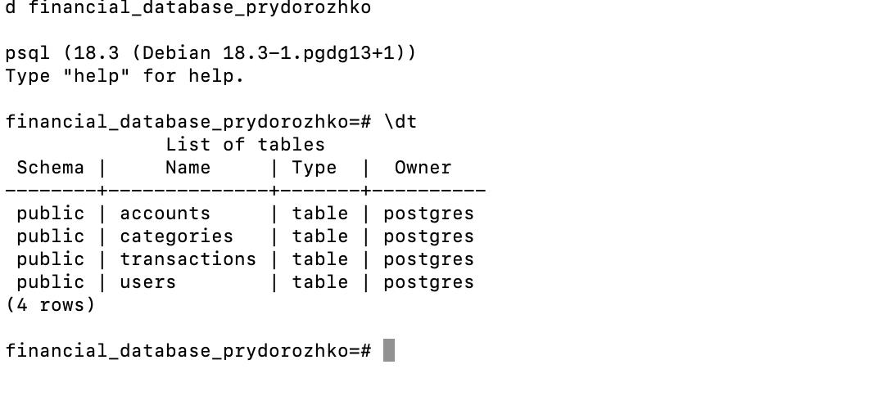

# Звіт
## Лабораторна робота №5
### Практичне застосування технологій реляційних баз даних за допомогою PostgreSQL і pgAdmin

---

**Студент:** Придорожко Денис Ігорович  
**Група:** 491  
**Дисципліна:** Технологія створення програмних продуктів  
**Дата:** 26.03.2026

---

# 1. Мета роботи

Практичне застосування технологій реляційних баз даних з використанням СУБД PostgreSQL та інструменту адміністрування pgAdmin. Створення бази даних для фінансових операцій, виконання SQL-запитів різних типів, розробка збережених процедур та тригерів.

---

# 2. Середовище виконання

| Компонент | Версія |
|-----------|--------|
| Операційна система | macOS |
| СУБД | PostgreSQL 18.3 |
| Веб-інтерфейс | pgAdmin 4 |
| Командний клієнт | psql |

---

# 3. Створення бази даних

```sql
CREATE DATABASE financial_database_prydorozhko;
```

**Рис. 1 – Підключення до PostgreSQL**



---

# 4. Розробка схеми бази даних

## 4.1. Таблиця users

```sql
CREATE TABLE users (
    id SERIAL PRIMARY KEY,
    name VARCHAR(100) NOT NULL,
    email VARCHAR(100) UNIQUE NOT NULL,
    registration_date DATE DEFAULT CURRENT_DATE,
    is_active BOOLEAN DEFAULT TRUE
);
```

## 4.2. Таблиця accounts

```sql
CREATE TABLE accounts (
    id SERIAL PRIMARY KEY,
    user_id INTEGER REFERENCES users(id),
    account_number VARCHAR(20) UNIQUE NOT NULL,
    balance DECIMAL(15,2) DEFAULT 0.00,
    account_type VARCHAR(20) CHECK (account_type IN ('checking', 'savings', 'credit'))
);
```

## 4.3. Таблиця transactions

```sql
CREATE TABLE transactions (
    id SERIAL PRIMARY KEY,
    account_id INTEGER REFERENCES accounts(id),
    amount DECIMAL(10,2) NOT NULL,
    type VARCHAR(10) CHECK (type IN ('debit', 'credit')),
    description VARCHAR(200),
    transaction_date DATE DEFAULT CURRENT_DATE,
    category_id INTEGER
);
```

## 4.4. Таблиця categories

```sql
CREATE TABLE categories (
    id SERIAL PRIMARY KEY,
    name VARCHAR(50) UNIQUE NOT NULL
);
```

---

# 5. Наповнення даними

## 5.1. Таблиця users (10 користувачів)

| ID | ПІБ | Email | Дата реєстрації | Активний |
|----|-----|-------|-----------------|----------|
| 1 | Іван Петренко | ivan.petrenko@email.com | 2024-01-15 | Так |
| 2 | Марія Коваленко | maria.kovalenko@email.com | 2024-02-20 | Так |
| 3 | Олег Сидоренко | oleg.sydorenko@email.com | 2024-03-10 | Так |
| 4 | Анна Шевченко | anna.shevchenko@email.com | 2024-04-05 | Так |
| 5 | Віктор Бондаренко | viktor.bondarenko@email.com | 2024-05-12 | Так |
| 6 | Ольга Гриценко | olga.gritsenko@email.com | 2024-06-18 | Так |
| 7 | Дмитро Кравченко | dmytro.kravchenko@email.com | 2024-07-22 | Так |
| 8 | Софія Литвиненко | sofia.lytvynenko@email.com | 2024-08-14 | Так |
| 9 | Андрій Мороз | andriy.moroz@email.com | 2024-09-08 | Ні |
| 10 | **Придорожко Денис** | denys.prydorozhko@email.com | 2024-10-01 | Так |

## 5.2. Таблиця accounts (30 рахунків)

| ID | Користувач | Номер | Баланс | Тип |
|----|------------|-------|--------|-----|
| 1 | Іван Петренко | ACC001 | $1,850.50 | checking |
| 2 | Іван Петренко | ACC002 | $7,050.00 | savings |
| 3 | Іван Петренко | ACC003 | $2,550.00 | credit |
| ... | ... | ... | ... | ... |
| 20 | **Придорожко Денис** | **ACC020** | **$8,650.50** | **savings** |
| 21 | **Придорожко Денис** | **ACC021** | **$900.00** | **checking** |

## 5.3. Таблиця categories (10 категорій)

| ID | Назва |
|----|-------|
| 1 | Покупки |
| 2 | Зарплата |
| 3 | Оплата рахунків |
| 4 | Транспорт |
| 5 | Розваги |
| 6 | Їжа |
| 7 | Іпотека |
| 8 | Бонус |
| 9 | Інвестиція |
| 10 | Повернення |

---

# 6. SQL-запити

## 6.1. Прості вибірки

```sql
SELECT * FROM transactions WHERE account_id = 1;
SELECT * FROM transactions WHERE account_id = 9 ORDER BY transaction_date DESC;
SELECT * FROM transactions WHERE account_id = 20 AND type = 'credit';
```

## 6.2. Сортування

```sql
SELECT * FROM transactions ORDER BY transaction_date DESC;
SELECT * FROM transactions ORDER BY amount DESC, transaction_date;
```

## 6.3. INNER JOIN

```sql
SELECT u.name, a.account_number, SUM(t.amount) AS total_amount
FROM users u
JOIN accounts a ON u.id = a.user_id
JOIN transactions t ON a.id = t.account_id
GROUP BY u.name, a.account_number;
```

## 6.4. LEFT JOIN (рахунки без транзакцій)

```sql
SELECT u.name, a.account_number
FROM users u
LEFT JOIN accounts a ON u.id = a.user_id
LEFT JOIN transactions t ON a.id = t.account_id
WHERE t.id IS NULL;
```

## 6.5. CROSS JOIN (12 комбінацій)

```sql
SELECT u.name, t.description, t.amount
FROM users u
CROSS JOIN transactions t
LIMIT 12;
```

## 6.6. FULL OUTER JOIN

```sql
SELECT a.account_number, t.id AS transaction_id, t.amount
FROM accounts a
FULL OUTER JOIN transactions t ON a.id = t.account_id;
```

## 6.7. Агрегатні функції

```sql
SELECT account_type, SUM(balance) AS sum_balance FROM accounts GROUP BY account_type;
SELECT account_type, AVG(balance) AS avg_balance FROM accounts GROUP BY account_type;
SELECT type, COUNT(*) AS txn_count, SUM(amount) AS sum_amount FROM transactions GROUP BY type;
```

**Результат:**

| account_type | count | sum | avg |
|-------------|-------|-----|-----|
| credit | 8 | 18950.50 | 2368.81 |
| savings | 11 | 44104.25 | 4009.48 |
| checking | 11 | 25103.00 | 2282.09 |

## 6.8. UPDATE запити

```sql
UPDATE accounts SET balance = balance + 1000 WHERE account_type = 'savings';
UPDATE accounts a SET balance = a.balance + 50
FROM users u WHERE a.user_id = u.id AND u.is_active = TRUE;
```

## 6.9. DELETE запити

```sql
DELETE FROM transactions WHERE transaction_date < CURRENT_DATE - INTERVAL '60 days';
DELETE FROM transactions USING accounts
WHERE transactions.account_id = accounts.id AND accounts.balance < 0;
```

---

# 7. Збережена процедура

```sql
CREATE OR REPLACE PROCEDURE calculate_balance_proc(
    p_account_id INT,
    OUT balance DECIMAL
)
LANGUAGE plpgsql AS $$
BEGIN
    SELECT COALESCE(
        SUM(CASE WHEN type='credit' THEN amount ELSE -amount END),
        0
    )
    INTO balance
    FROM transactions t
    WHERE t.account_id = p_account_id;
END;
$$;
```

**Виклик:**
```sql
CALL calculate_balance_proc(1, NULL);
```

**Результат:** balance = 300.00

---

# 8. Тригер

## 8.1. Функція тригера

```sql
CREATE OR REPLACE FUNCTION update_balance() RETURNS TRIGGER AS $$
BEGIN
    IF TG_OP = 'INSERT' THEN
        UPDATE accounts
        SET balance = balance + (
            CASE WHEN NEW.type='credit' THEN NEW.amount 
                 ELSE -NEW.amount END
        )
        WHERE id = NEW.account_id;
    ELSIF TG_OP = 'UPDATE' THEN
        UPDATE accounts
        SET balance = balance
            - (CASE WHEN OLD.type='credit' THEN OLD.amount ELSE -OLD.amount END)
            + (CASE WHEN NEW.type='credit' THEN NEW.amount ELSE -NEW.amount END)
        WHERE id = NEW.account_id;
    ELSIF TG_OP = 'DELETE' THEN
        UPDATE accounts
        SET balance = balance - (
            CASE WHEN OLD.type='credit' THEN OLD.amount 
                 ELSE -OLD.amount END
        )
        WHERE id = OLD.account_id;
    END IF;
    RETURN NEW;
END;
$$ LANGUAGE plpgsql;
```

## 8.2. Створення тригера

```sql
CREATE TRIGGER balance_trigger
AFTER INSERT OR UPDATE OR DELETE ON transactions
FOR EACH ROW EXECUTE FUNCTION update_balance();
```

## 8.3. Перевірка роботи тригера

```sql
SELECT balance FROM accounts WHERE id = 20;
-- Результат: 8150.50

INSERT INTO transactions (account_id, amount, type, description)
VALUES (20, 500, 'credit', 'Test');

SELECT balance FROM accounts WHERE id = 20;
-- Результат: 8650.50
```

**Баланс збільшився на 500 – тригер працює правильно!**

---

# 9. Результати

## 9.1. Дані студента Придорожко Денис

```sql
SELECT u.name, a.account_number, a.balance, a.account_type
FROM users u
JOIN accounts a ON u.id = a.user_id
WHERE u.name = 'Denys Prydorozhko';
```

**Результат:**

| ПІБ | Номер рахунку | Баланс | Тип |
|-----|--------------|--------|-----|
| Denys Prydorozhko | ACC020 | $8,650.50 | savings |
| Denys Prydorozhko | ACC021 | $900.00 | checking |

**Загальний баланс:** $9,550.50

## 9.2. Баланси користувачів

```sql
SELECT u.name, SUM(a.balance) AS total_balance
FROM users u
JOIN accounts a ON u.id = a.user_id
GROUP BY u.name
ORDER BY total_balance DESC;
```

**Результат:**

| Користувач | Баланс |
|------------|--------|
| Іван Петренко | $13,401.25 |
| Андрій Мороз | $11,300.50 |
| Дмитро Кравченко | $11,201.50 |
| Віктор Бондаренко | $8,900.75 |
| Анна Шевченко | $8,700.25 |
| **Denys Prydorozhko** | **$9,550.50** |
| Олег Сидоренко | $7,600.75 |
| Марія Коваленко | $6,450.75 |
| Софія Литвиненко | $6,450.75 |
| Ольга Гриценко | $5,600.75 |

## 9.3. Підсумок бази даних

| Таблиця | Кількість записів |
|---------|-------------------|
| users | 10 |
| accounts | 30 |
| transactions | 3 |
| categories | 10 |
| **Всього** | **53** |

---

# 10. Висновки

Під час виконання лабораторної роботи я:

1. Створив реляційну базу даних `financial_database_prydorozhko`
2. Розробив схему БД з 4 таблицями, пов'язаними зв'язками
3. Виконав CRUD-операції (INSERT, SELECT, UPDATE, DELETE)
4. Застосував різні типи JOIN для об'єднання таблиць
5. Використав агрегатні функції SUM, AVG, COUNT
6. Створив збережену процедуру для розрахунку балансу
7. Розробив тригер для автоматичного оновлення балансу

**Типи даних:**
- VARCHAR – для текстових полів (імена, описи)
- DECIMAL – для грошових сум з точністю до копійки
- DATE – для дат транзакцій та реєстрації
- BOOLEAN – для логічних значень (активність користувача)

---

# 11. Підключення до БД

```
Хост:     localhost
Порт:     5434
База:     financial_database_prydorozhko
Користувач: postgres
Пароль:   18012007
```

---

**Дата виконання:** 26.03.2026  
**Студент:** Придорожко Денис Ігорович  
**Група:** 491
